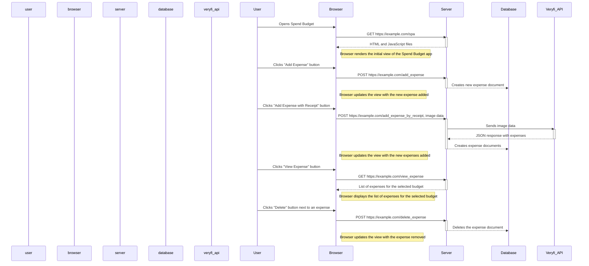

```mermaid

sequenceDiagram
    participant user
    participant browser
    participant server
    participant database
    participant veryfi_api

    User->>Browser: Opens Spend Budget
    Browser->>Server: GET https://example.com/spa
    activate Server
    Server-->>Browser: HTML and JavaScript files
    deactivate Server

    Note right of Browser: Browser renders the initial view of the Spend Budget app

    User->>Browser: Clicks "Add Expense" button
    Browser->>Server: POST https://example.com/add_expense
    activate Server
    Server-->>Database: Creates new expense document
    deactivate Server

    Note right of Browser: Browser updates the view with the new expense added

    User->>Browser: Clicks "Add Expense with Receipt" button
    Browser->>Server: POST https://example.com/add_expense_by_receipt, image data
    activate Server
    Server->>Veryfi_API: Sends image data
    activate Veryfi_API
    Veryfi_API-->>Server: JSON response with expenses
    deactivate Veryfi_API
    Server-->>Database: Creates expense documents
    deactivate Server

    Note right of Browser: Browser updates the view with the new expenses added

    User->>Browser: Clicks "View Expense" button
    Browser->>Server: GET https://example.com/view_expense
    activate Server
    Server-->>Browser: List of expenses for the selected budget
    deactivate Server

    Note right of Browser: Browser displays the list of expenses for the selected budget

    User->>Browser: Clicks "Delete" button next to an expense
    Browser->>Server: POST https://example.com/delete_expense
    activate Server
    Server-->>Database: Deletes the expense document
    deactivate Server

    Note right of Browser: Browser updates the view with the expense removed

```
